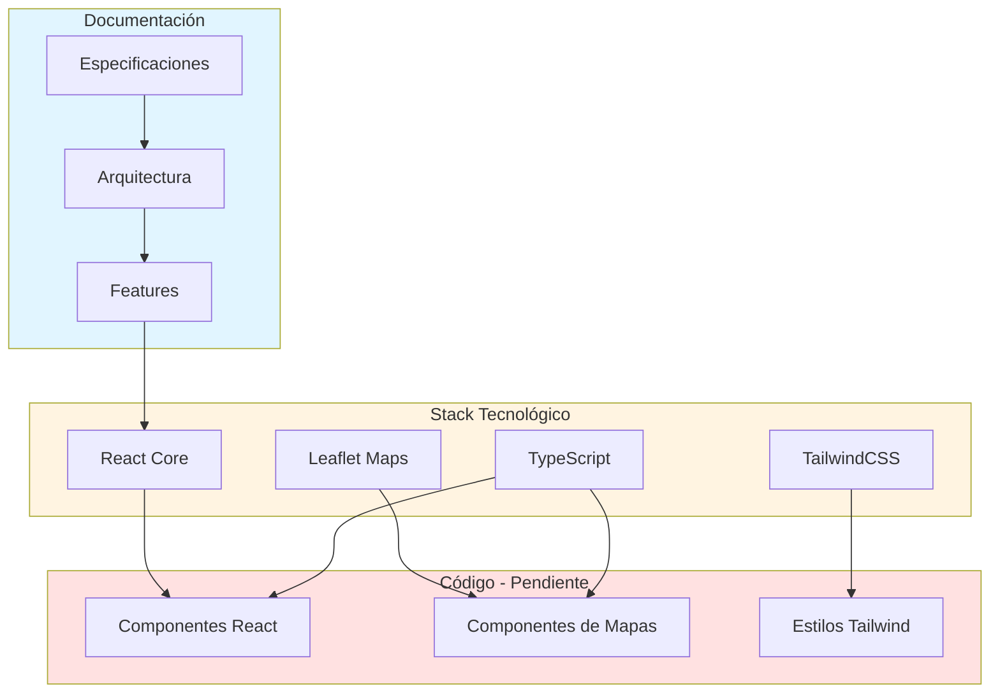

# Arquitectura - map-monitor

Documentación de la arquitectura del proyecto map-monitor.

## Tech Stack

- **Runtime**: Node.js
- **Lenguaje**: TypeScript
- **Framework Core**: React
- **Biblioteca de Mapas**: Leaflet
- **Estilos**: TailwindCSS
- **Gestión de dependencias**: Por definir (npm/yarn/pnpm)

## Estructura del Proyecto

```
map-monitor/
├── docs/                    # Documentación
│   ├── architecture/        # Este archivo y arquitectura detallada
│   ├── features/           # Especificaciones de features
│   ├── setup/              # Guías de instalación
│   └── ...
├── scripts/                # Scripts de utilidad y automatización
└── [código fuente]         # Estructura a definir según features
```

## Principios Arquitectónicos

1. **Spec-Driven Development**: Toda la documentación debe estar completa antes de implementar código
2. **Documentación Viva**: La documentación se mantiene actualizada con el código
3. **Separación de Responsabilidades**: Cada feature documentada de forma independiente

## Decisiones Arquitectónicas

### Iniciales

- **TypeScript**: Elección para tipado estático y mejor mantenibilidad
- **Node.js**: Runtime para aplicaciones JavaScript/TypeScript
- **React**: Framework core para la interfaz de usuario
- **Leaflet**: Biblioteca para visualización y manipulación de mapas interactivos
- **TailwindCSS**: Framework CSS utility-first para estilos
- **Metodología Spec-Driven**: Garantiza que el diseño esté completo antes de la implementación

### Pendientes de Definir

- Sistema de build y bundling (Vite, Webpack, etc.)
- Testing framework (Jest, Vitest, React Testing Library, etc.)
- Gestión de estado (Context API, Zustand, Redux, etc.)
- Routing (React Router, etc.)
- Patrones de diseño específicos

## Diagrama de Arquitectura General



## Patrones de Diseño

A definir según las necesidades específicas de las features implementadas.

## Referencias

- [README Principal](../../README.md)
- [Índice de Documentación](../index.md)
- [AGENTS.md](../../AGENTS.md) - Reglas y convenciones

