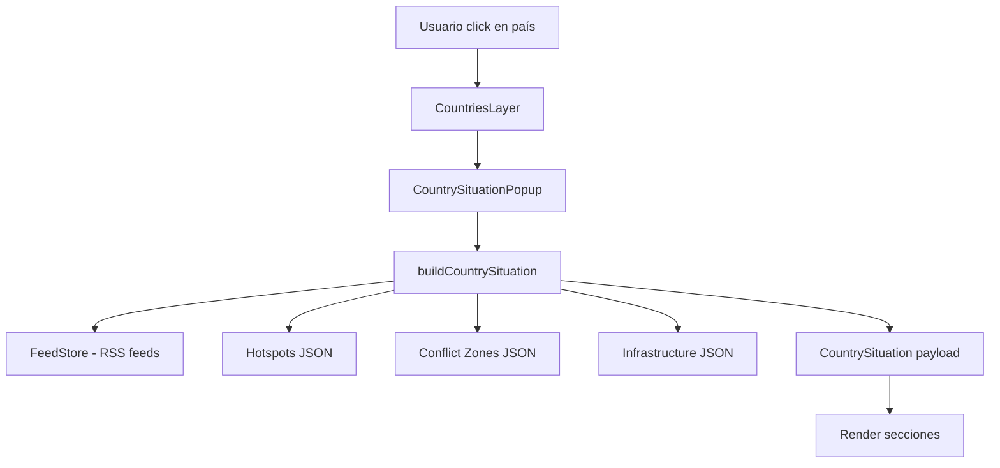

# GlobalMap

## Descripción

`GlobalMap` es el componente central de **map-monitor**.  
Representa un mapa mundial interactivo que actúa como **superficie de inteligencia**, integrando eventos geopolíticos, infraestructuras críticas y fenómenos naturales en una única vista contextual.

No es un mapa de navegación, sino un **mapa semántico de situación**: cada elemento visible tiene significado estratégico.

---

## Objetivos

- Proporcionar una **visión global inmediata** del estado del mundo.
- Superponer **capas de eventos y activos críticos** sobre el mapa.
- Ofrecer **contexto en tiempo real** mediante tooltips enriquecidos.
- Servir como punto de anclaje visual para feeds, correlaciones y monitores personalizados.

---

## Rol dentro del sistema

- **Feature core** del proyecto.
- Punto de entrada cognitivo para el usuario.
- Fuente primaria de contexto espacial para:
  - Monitores personalizados
  - Correlaciones
  - Narrativas
  - Alertas

---

## Capas del Mapa (Map Layers)

El mapa se compone de múltiples capas independientes, activables y extensibles.

### 1. Base Geográfica

- Países del mundo (proyección global)
- Diferenciación visual de países sancionados
- Graticulado (latitud / longitud)
- Etiquetas oceánicas

**Propósito**: orientación y contexto geográfico.

---

### 2. Hotspots Geopolíticos

Puntos estratégicos con nivel de amenaza asociado.

**Atributos**:
- Nombre
- Latitud / Longitud
- Nivel: `low | elevated | high`
- Descripción contextual

**Visualización**:
- Círculo central
- Anillo pulsante
- Color según amenaza

---

### 3. Zonas de Conflicto

Regiones activas de conflicto representadas como polígonos aproximados.

**Ejemplos**:
- Ucrania
- Gaza
- Taiwán Strait
- Yemen

**Propósito**: indicar regiones de alta inestabilidad persistente.

---

### 4. Infraestructura Estratégica

#### 4.1 Shipping Chokepoints
- Canales y estrechos clave del comercio global
- Representados con marcadores específicos

#### 4.2 Cables Submarinos
- Puntos de aterrizaje de grandes hubs de conectividad
- Infraestructura crítica digital

#### 4.3 Instalaciones Nucleares
- Enriquecimiento
- Plantas nucleares
- Zonas sensibles

#### 4.4 Bases Militares
- Principales bases y hubs estratégicos
- Representación simbólica diferenciada

---

### 5. Fenómenos Naturales

#### 5.1 Alertas Meteorológicas
- Alertas severas/extremas
- Agrupadas por región
- Severidad codificada por color

#### 5.2 Terremotos
- Actividad sísmica reciente
- Tamaño y color según magnitud
- Profundidad y tiempo en tooltip

---

### 6. Ciclo Día / Noche

- Terminador día-noche calculado dinámicamente
- Sombreado del hemisferio nocturno

**Propósito**:
- Contexto temporal
- Soporte visual para análisis geoestratégico

---

## Tooltips Enriquecidos

Los elementos interactivos del mapa generan tooltips dinámicos.

### Contenido típico de un tooltip

- Descripción del punto/zona
- Hora local calculada
- Condiciones meteorológicas actuales
- Tráfico aéreo aproximado
- Titular de noticia relevante (si aplica)

**Nota**: los datos se cargan bajo demanda y pueden cachearse en cliente.

---

## Country Situation Popup

El popup de situación de país es una **vista estratégica completa** que responde a la pregunta: "¿Qué está pasando ahora mismo en este país?"

### Activación

- **Click en país**: Abre el popup de situación completa
- **Hover en país**: Muestra tooltip básico (nombre del país)

### Estructura del Popup

El popup se compone de **secciones modulares**, mostradas solo si hay datos disponibles:

#### 1. Encabezado (siempre visible)

- **Nombre del país**: Título principal
- **Hora local**: Calculada desde la longitud geográfica del país
- **Indicador de actividad**: Badge de color (low/medium/high) basado en menciones RSS y eventos recientes
  - `low`: 0-2 menciones, 0-1 eventos recientes
  - `medium`: 3-5 menciones, 2-4 eventos recientes
  - `high`: 6+ menciones, 5+ eventos recientes

#### 2. Actividad Reciente

Resumen cuantitativo de eventos detectados en las últimas 24 horas:

- **Total de eventos**: Contador agregado
- **Distribución por tipo**:
  - 📰 Noticias
  - ⚔️ Conflicto
  - 🏗️ Infraestructura
  - Otros

Solo se muestra si hay eventos detectados.

#### 3. Eventos Relevantes

Lista curada y limitada de eventos recientes (máximo 5):

- **Iconos por tipo**: 🚨 Alert, ⚔️ Conflict, 🏗️ Infrastructure, 📰 News
- **Título**: Texto corto del evento
- **Timestamp relativo**: "2h ago", "6h ago", "1d ago"
- **Fuente**: Nombre del medio (si disponible)

Los eventos se deduplican por título normalizado y se ordenan por fecha (más recientes primero).

#### 4. Señales Geográficas

Ubicaciones clave dentro del país:

- **Hotspots**: Puntos geopolíticos estratégicos con nivel de amenaza
- **Zonas de Conflicto**: Regiones de conflicto activo
- **Infraestructura Crítica**: 
  - 🔌 Cable Landings
  - ⚛️ Nuclear Sites
  - 🎖️ Military Bases

Solo se muestra si hay señales geográficas relacionadas con el país.

### Arquitectura Técnica

#### Servicio Centralizado

El servicio `countrySituationService.ts` centraliza la lógica de construcción del payload:

- **`buildCountrySituation()`**: Función principal que agrega todos los datos
- **`getActivityLevel()`**: Calcula el nivel de actividad
- **`findGeographicSignals()`**: Identifica hotspots, conflict zones e infraestructura relacionada
- **`getRelevantEvents()`**: Filtra y procesa eventos de feeds RSS

#### Matching por Nombre

El sistema usa **matching aproximado por nombre** para relacionar:

- **Hotspots** → Países: Mapeos conocidos (ej: "Suez Canal" → "Egypt")
- **Conflict Zones** → Países: Matching directo por nombre
- **Infraestructura** → Países: Mapeos conocidos (ej: "Ramstein" → "Germany")
- **Feeds RSS** → Países: Usa `extractCountriesFromFeeds` existente

#### Reutilización Futura

El payload `CountrySituation` está diseñado para ser reutilizado en:

- **Paneles laterales**: Vista expandida de situación
- **Correlation Engine**: Input para correlaciones
- **Narrative Tracker**: Anclaje de narrativas a países

### Flujo de Datos

### Consideraciones de UX

- **Renderizado progresivo**: Skeleton primero, luego datos conforme estén disponibles
- **Sin parpadeos**: Tamaño fijo del popup, sin cambios bruscos
- **No bloquea el mapa**: Popup se cierra con click fuera
- **Diseño limpio**: Jerarquía clara, mucho espacio en blanco, legible en 3 segundos
- **Solo muestra datos disponibles**: No muestra secciones vacías ni "No data"

---

## Fuentes de Datos

El mapa consume datos de múltiples APIs públicas:

- Geografía mundial (TopoJSON / GeoJSON)
- Clima y alertas meteorológicas
- Actividad sísmica global
- Tráfico aéreo
- Noticias geopolíticas

> Todas las fuentes deben documentarse de forma centralizada en `docs/architecture/DataSources.md`.

---

## Interacción del Usuario

El mapa funciona como un **panel de monitorización fijo**, conceptualmente equivalente a un SVG interactivo. Su propósito es la visualización estratégica global, no la navegación exploratoria.

### Modelo de Interacción

- **Pan (arrastre)**: **Deshabilitado** - El mapa permanece fijo en su posición inicial
- **Zoom**: **Habilitado** - Permite zoom analítico desde el centro fijo para:
  - Analizar densidad de eventos
  - Acercarse a regiones concretas
  - Entender clusters
- **Zoom máximo**: Limitado a nivel 4 para mantener la perspectiva global
- **Controles de zoom**: Panel de controles personalizado (esquina superior izquierda) con:
  - Botón "Zoom In" (+) - Acerca la vista
  - Botón "Zoom Out" (-) - Aleja la vista
  - Botón "Reset View" - Restaura la vista inicial (zoom 2, centro [20, 0])
- **Hover**: Para obtener contexto inmediato mediante tooltips enriquecidos

### Comportamiento Técnico

El mapa se comporta como un monitor en tiempo real:
- El centro del mapa (`[20, 0]`) se mantiene estable durante todas las operaciones de zoom
- El usuario no puede desplazar el mapa libremente
- El zoom es analítico, no exploratorio: siempre desde el mismo centro lógico
- Zoom máximo limitado a nivel 4 para preservar la visión estratégica global
- Los controles de zoom se deshabilitan automáticamente al alcanzar los límites (zoom 2 mínimo, zoom 4 máximo)
- El reset de vista es instantáneo (sin animación) para mantener la sensación de "monitor fijo"
- La sensación debe ser de "pantalla de control", no de "mapa navegable tipo Google Maps"

### Integración con otras Features

- Monitores personalizados
- Sistema de correlación
- Narrativas

---

## Visual Legend & Semantic Encoding

El mapa incluye una **leyenda visual persistente** integrada en la esquina inferior izquierda que permite entender el significado de todos los elementos visibles en menos de 5 segundos.

### Propósito

La leyenda actúa como **referencia semántica inmediata**, eliminando la necesidad de interpretación manual o conocimiento previo. Cada símbolo, color y forma tiene un significado estratégico específico.

### Sistema de Codificación Visual

#### Hotspots Geopolíticos

Puntos estratégicos con nivel de amenaza codificado por **color y tamaño**:

- **High Threat** (Rojo `#EF4444`): Círculo de 16px - Amenaza crítica, requiere atención inmediata
- **Elevated** (Amarillo `#F59E0B`): Círculo de 12px - Riesgo moderado, monitoreo activo
- **Low Threat** (Verde `#10B981`): Círculo de 8px - Región monitoreada, bajo riesgo actual

**Interpretación**: El tamaño y color indican **prioridad visual** e **intensidad de amenaza**. Los hotspots rojos grandes deben captar la atención primero.

#### Zonas de Conflicto

- **Active Conflict** (Rojo `#DC2626` con opacidad 0.2): Rectángulo semitransparente con borde `#991B1B`
- Representa regiones de **conflicto activo y persistente**
- El área sombreada indica la extensión aproximada de la zona de conflicto

**Interpretación**: Las zonas de conflicto son **polígonos de área**, no puntos. Indican regiones de alta inestabilidad geopolítica.

#### Infraestructura Estratégica

Infraestructura crítica diferenciada por **color específico**:

- **Cable Landings** (Azul `#3B82F6`): Círculo de 10px - Hubs de conectividad digital submarina
- **Nuclear Sites** (Amarillo `#F59E0B`): Círculo de 12px - Instalaciones nucleares (enriquecimiento, plantas, zonas sensibles)
- **Military Bases** (Violeta `#8B5CF6`): Círculo de 11px - Bases militares estratégicas

**Interpretación**: La infraestructura estratégica se representa con **colores únicos** para facilitar identificación rápida. El tamaño es consistente dentro de cada categoría.

#### RSS / Countries

Actividad de noticias por país codificada por **color y tamaño** según número de menciones:

- **1 mención** (Verde `#10B981`): Cuadrado de 8px - Actividad mínima
- **2-3 menciones** (Amarillo `#F59E0B`): Cuadrado de 10px - Actividad moderada
- **4-5 menciones** (Naranja `#F97316`): Cuadrado de 12px - Actividad elevada
- **6+ menciones** (Rojo `#EF4444`): Cuadrado de 14px - Actividad crítica

**Interpretación**: El sistema de **gradiente de color** (verde → amarillo → naranja → rojo) y **tamaño progresivo** indica intensidad de cobertura mediática. Los países con más menciones aparecen más grandes y rojos.

### Priorización Visual

El mapa está diseñado para comunicar **contexto, prioridad e intensidad** de forma inmediata:

1. **Elementos críticos** (Hotspots rojos, Conflict Zones) captan atención primero
2. **Infraestructura estratégica** (colores únicos) permite identificación rápida
3. **Actividad RSS** (gradiente de color) muestra intensidad de cobertura

### Formas y Significados

- **Círculos**: Puntos geográficos específicos (hotspots, infraestructura)
- **Rectángulos**: Áreas/zonas geográficas (conflict zones)
- **Cuadrados**: Actividad RSS por país (diferenciación visual de círculos)

### Contraste y Visibilidad

Todos los marcadores circulares incluyen:
- **Borde blanco** (`#FFFFFF`, 2px) para garantizar visibilidad sobre cualquier fondo
- **Opacidad 0.8** para el relleno, permitiendo cierta transparencia sin perder legibilidad
- **Sombra** en marcadores RSS para profundidad visual

### Ubicación de la Leyenda

La leyenda está **siempre visible** en la esquina inferior izquierda del mapa, con:
- Fondo semitransparente (`bg-gray-800/95`) con blur para legibilidad
- Borde y sombra coherentes con el sistema de diseño
- Ancho máximo de 240px para mantener compactitud
- z-index 1000 (mismo nivel que controles) para permanecer visible

---

## Consideraciones Técnicas

### Implementación D3.js

El mapa utiliza **D3.js** con la proyección **geoEqualEarth()** para renderizado estático:

- **Componente base**: `D3Map.tsx` - SVG con proyección geoEqualEarth() configurada
- **Renderizado**: Todas las capas se renderizan como elementos SVG usando `d3.select()` y `d3.geoPath()`
- **Proyección**: geoEqualEarth() preserva áreas y es ideal para mapas mundiales estáticos
- **Zoom**: Implementado con `d3-zoom` limitado a niveles 2-4, sin pan/arrastre
- **Tooltips/Popups**: Sistema nativo con posicionamiento absoluto, sin dependencias de Leaflet

### Arquitectura de Capas

- Renderizado mediante capas superpuestas en SVG
- Separación clara entre:
  - Datos (JSON, GeoJSON)
  - Lógica de transformación (proyección, escalas)
  - Render visual (SVG elements)
- Preparado para:
  - Activación/desactivación de capas
  - Filtros dinámicos
  - Extensión futura (nuevas capas)

---

## Estado de Implementación

### v1 - Capas Básicas ✅

- ✅ **Countries Layer**: Capa de países con GeoJSON remoto, tooltips básicos y hover highlight
- ✅ **Hotspots Layer**: 10 hotspots geopolíticos con niveles (low/elevated/high), marcadores circulares y tooltips
- ✅ **Conflict Zones Layer**: 4 zonas de conflicto (Ukraine, Gaza, Taiwan Strait, Yemen) con polígonos y tooltips
- ✅ **Layer Toggles**: UI de control para encender/apagar capas con persistencia en localStorage
- ✅ **Tooltips Simples**: Sistema unificado de tooltips preparado para enriquecimiento futuro
- ✅ **Z-index Ordering**: Orden correcto de capas (countries < conflicts < hotspots)

### v1.1 - Tooltips Enriquecidos ✅

- ✅ **Tooltips Enriquecidos**: Tooltips con contexto ambiental para puntos geográficos
  - Hora local calculada desde longitud geográfica
  - Clima actual desde Open-Meteo API (condición, temperatura, viento)
  - Carga bajo demanda con cache en memoria por sesión
  - Aplicado a: Hotspots, Cable Landings, Nuclear Sites, Military Bases

### v1.2 - Panel de Monitorización Fijo ✅

- ✅ **Mapa Fijo**: Comportamiento de panel de monitorización, no mapa navegable
  - Pan/arrastre deshabilitado (`dragging: false`)
  - Zoom habilitado (rueda, doble clic, táctil) para análisis
  - Centro fijo mantenido durante todas las operaciones de zoom
  - Navegación con teclado deshabilitada
  - Zoom con caja deshabilitado
  - Componente `FixedCenter` que fuerza el centro a `[20, 0]` tras cada cambio de zoom

### v1.3 - Controles de Zoom y Límites ✅

- ✅ **Zoom Máximo**: Limitado a nivel 4 (`maxZoom={4}`) para mantener perspectiva global
- ✅ **Controles Personalizados**: Panel de controles en esquina superior izquierda
  - Botón Zoom In (+) con deshabilitación automática al alcanzar zoom máximo
  - Botón Zoom Out (-) con deshabilitación automática al alcanzar zoom mínimo
  - Botón Reset View para restaurar vista inicial (zoom 2, centro [20, 0]) sin animación
  - Estilo consistente con LayerToggles (fondo gris, bordes, accesibilidad 44x44px mínimo)
  - Componente `MapControls` usando hook `useMap` de react-leaflet

### v1.4 - Country Situation Popup ✅

- ✅ **Popup de Situación de País**: Vista estratégica completa al hacer click en un país
  - **Encabezado**: Nombre del país, hora local calculada, indicador de actividad (low/medium/high)
  - **Actividad Reciente**: Resumen agregado de eventos detectados (últimas 24h) con distribución por tipo (noticias, conflicto, infraestructura)
  - **Eventos Relevantes**: Lista curada de 3-5 eventos recientes con iconos, títulos, timestamps relativos y fuentes
  - **Señales Geográficas**: Hotspots, zonas de conflicto e infraestructura crítica dentro del país
  - Renderizado progresivo con skeleton loading
  - Diseño limpio y escaneable con jerarquía visual clara
  - Servicio centralizado (`countrySituationService.ts`) reutilizable para futuras features
  - Matching aproximado por nombre para relacionar hotspots/infraestructura con países
  - Integración con feeds RSS para eventos en tiempo real

**Arquitectura**:
- Servicio `buildCountrySituation()` centraliza la lógica de agregación
- Componente `CountrySituationPopup` renderiza la vista estructurada
- Payload `CountrySituation` preparado para reutilización en Correlation Engine y Narrative Tracker
- Click en país abre popup, hover mantiene tooltip básico

### v2.0 - Migración a D3.js ✅

- ✅ **Migración completa a D3.js**: Reemplazo de Leaflet por D3.js con proyección geoEqualEarth()
  - Componente base `D3Map.tsx` con SVG y proyección geoEqualEarth()
  - Todas las capas migradas a D3.js (Countries, Hotspots, Conflicts, Cables, Nuclear, Military, RSS Countries)
  - Sistema de tooltips y popups nativo con D3 (sin dependencias de Leaflet)
  - Zoom limitado con d3-zoom (niveles 2-4) sin pan/arrastre
  - Controles de zoom adaptados para D3.js
  - Utilidades de proyección y escalas en `d3MapUtils.ts`
  - Eliminación de dependencias de Leaflet (react-leaflet, leaflet, @types/leaflet)
  - Añadidas dependencias D3.js (d3, d3-geo, @types/d3)

### Pendiente (Futuras Versiones)

- ⏳ Infraestructura Estratégica (Shipping Chokepoints - ya implementado parcialmente)
- ⏳ Fenómenos Naturales (Alertas Meteorológicas, Terremotos)
- ⏳ Ciclo Día / Noche
- ⏳ Tooltips con noticias y tráfico aéreo

---

## Relación con otras Features

- `Monitors` → inyectan puntos y zonas dinámicas en el mapa
- `CorrelationEngine` → utiliza eventos del mapa como input
- `NarrativeTracker` → ancla narrativas a regiones y hotspots

---
